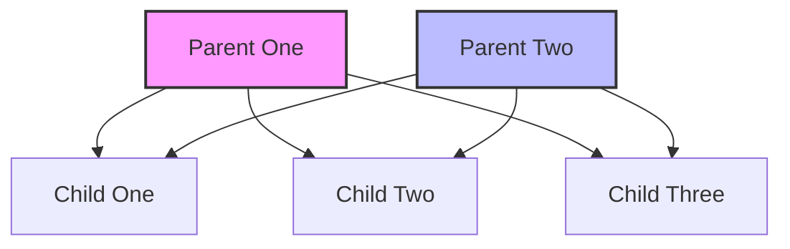
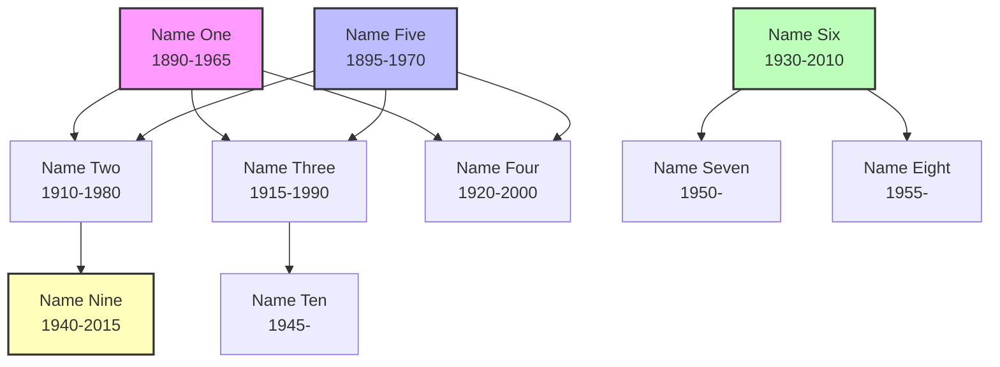
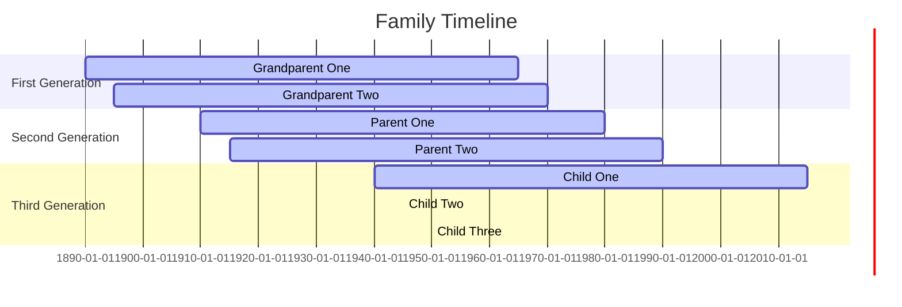
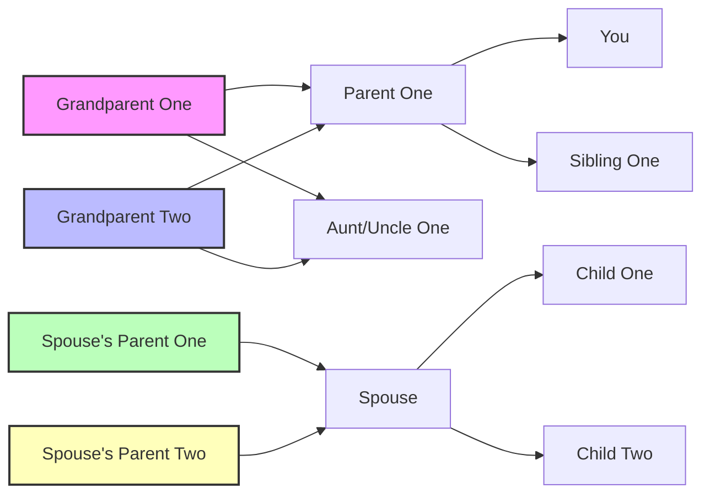

# Mermaid Family Tree Diagram Template

This folder contains templates for creating family tree visualizations using Mermaid diagrams.

## Basic Family Tree Diagram

This template shows a simple family tree with two parents and their children.



## Enhanced Family Tree with Lifespans

This template shows a family tree with birth and death dates.



## Timeline Visualization

This template shows a family timeline using a Gantt chart.



## Relationship Map

This template shows a more complex relationship map.



## Historical Context

This template shows a family tree with historical events.

```mermaid
gantt
    title Family Timeline with Historical Context
    dateFormat YYYY
    
    section Family Events
    Grandparent One       :active, gen1, 1890, 1965
    World War I           :milestone, wwi, 1914, 1918
    Parent One            :active, gen2, 1910, 1980
    World War II          :milestone, wwii, 1939, 1945
    Child One             :active, gen3, 1940, 2015
    Cold War              :phase, coldwar, 1947, 1991
    Child Two             :active, gen4, 1950, -
    9/11                  :milestone, 911, 2001, 2001
    Child Three           :active, gen5, 1955, -
    
    section Historical Events
    Spanish Flu           :active, flu, 1918, 1920
    Great Depression      :phase, depression, 1929, 1939
    Vietnam War           :active, vietnam, 1955, 1975
    Internet Age          :phase, internet, 1990, -
```

## Customization

You can customize these templates by:

1. Changing colors using the `style` directive
2. Adding more people or events
3. Adjusting the layout using different Mermaid graph types
4. Including images or links to more detailed information

For more advanced visualizations, consider using D3.js examples in the `d3` folder.
