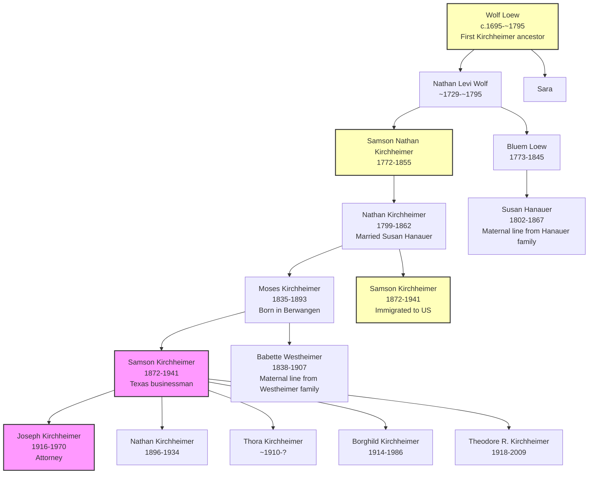
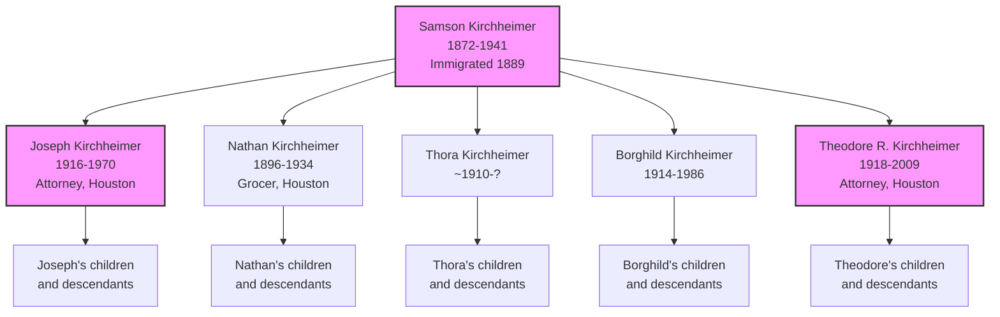
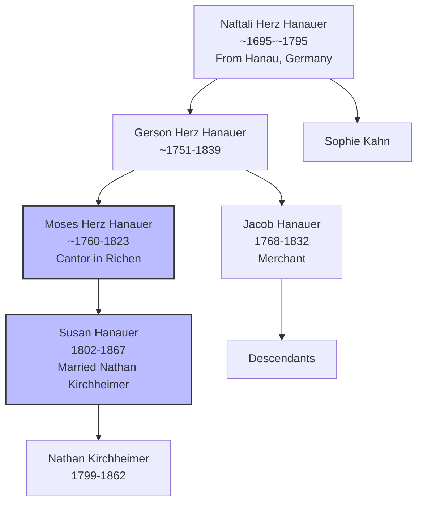
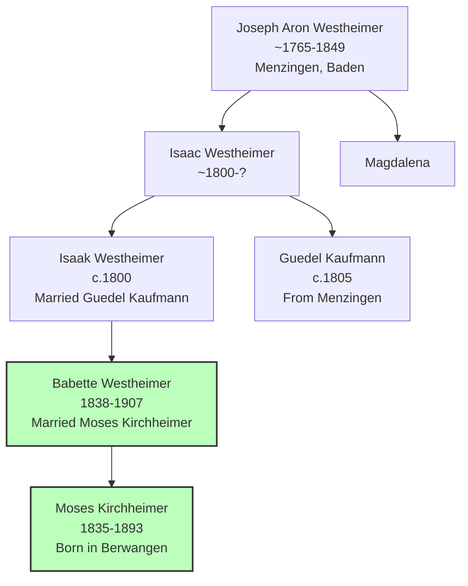
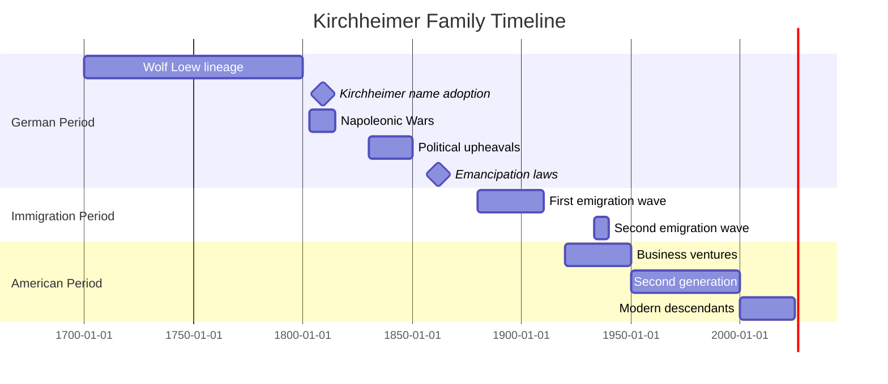

# Kirchheimer Family Tree Mermaid Templates

This folder contains Mermaid templates specifically designed for visualizing the Kirchheimer family tree data.

## Main Kirchheimer Lineage

This template shows the main Kirchheimer lineage from the 18th century to the present day.



## Kirchheimer in America

This template focuses on the American branch of the Kirchheimer family.



## Hanauer Lineage

This template shows the Hanauer maternal lineage which connects to the Kirchheimer family.



## Westheimer Lineage

This template shows the Westheimer maternal lineage which also connects to the Kirchheimer family.



## Timeline of Kirchheimer Family

This template shows a timeline of key events in the Kirchheimer family history.



## Historical Context

This template shows the Kirchheimer family timeline with important historical events.

```mermaid
gantt
    title Kirchheimer Family in Historical Context
    dateFormat YYYY
    
    section Family Events
    Wolf Loew in Germany   :active, wolf, 1720, 1800
    Kirchheimer name       :milestone, name, 1809, 1809
    Emancipation           :milestone, emanc, 1862, 1862
    Immigration to US      :active, imm, 1880, 1920
    Holocaust              :active, holocaust, 1933, 1945
    American success       :active, success, 1950, 2000
    
    section Historical Events
    Seven Years' War       :active, war1, 1756, 1763
    French Revolution      :milestone, fr, 1789, 1799
    Napoleonic Wars        :active, nap, 1803, 1815
    1848 Revolutions       :milestone, 1848, 1848
    German Unification     :milestone, germ, 1871, 1871
    World War I            :active, wwi, 1914, 1918
    Great Depression       :phase, gd, 1929, 1939
    World War II           :active, wwii, 1939, 1945
    Cold War               :phase, cw, 1947, 1991
